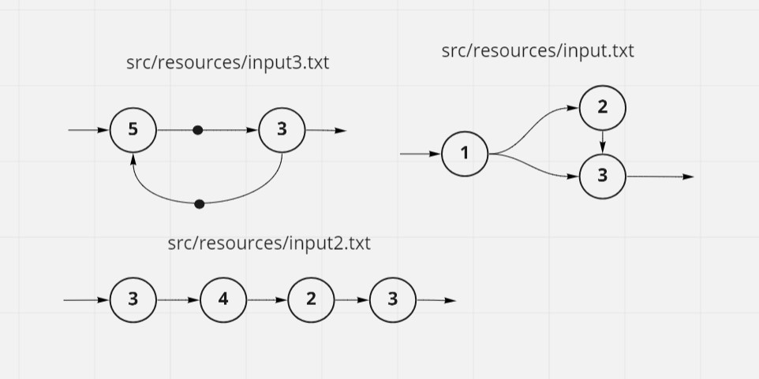
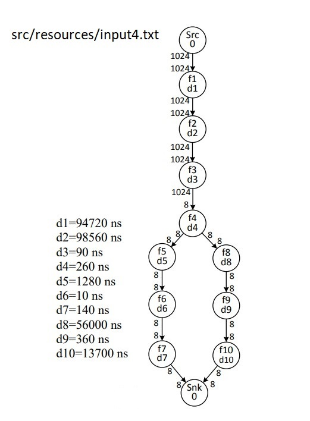

# Synchronous Data Flow Graph Calculator
This is an implementation of Synchronous Data Flow Graphs (SDF) for hardware/Software Codesign university lesson in Kotlin.
 
Some test files are added in resources folder to use. 
Test files graph is same as below

  
  

